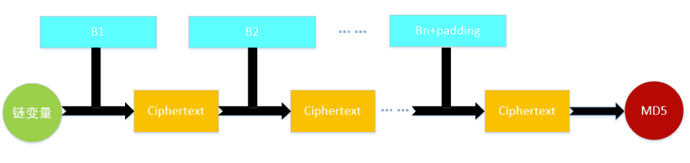
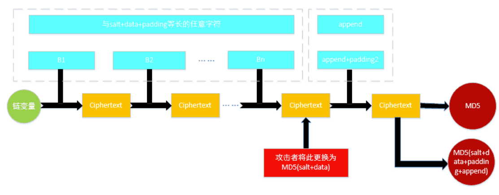
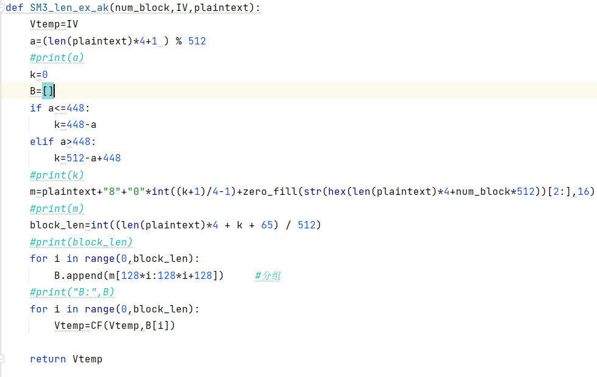
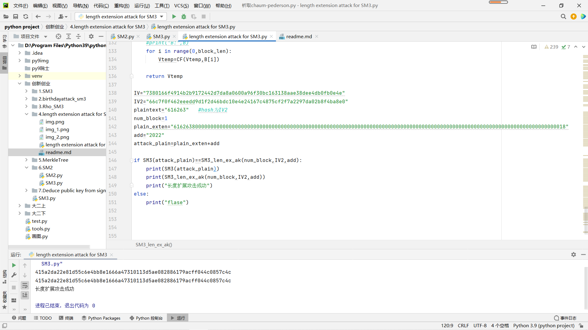

# 长度扩展攻击
## 项目简介
长度扩展攻击（length extension attack），是指针对某些允许包含额外信息的加密散列函数的攻击手段。对于满足以下条件的散列函数，都可以作为攻击对象：

       ① 加密前将待加密的明文按一定规则填充到固定长度（例如512或1024比特）的倍数；

       ② 按照该固定长度，将明文分块加密，并用前一个块的加密结果，作为下一块加密的初始向量（Initial Vector）。
### 攻击方法如下(以MD5为例)

  如果攻击者知道MD5(salt+data)的值并可控制data的值，攻击者可以设定data为与data+padding+append等长的任意字符串，然后计算MD5(str+append)。我们知道，MD5需要先填充再运算，攻击者可以在程序计算append所在块之前，将MD5(salt+data)的值直接替换掉初始的链变量，就能够算出MD5(salt+data+padding+append)的值了。设MD5(CV,data)表示以链变量CV计算data的MD5值，那么（为简便起见，这里设append的长度不超过448比特，超过的原理也类似）  
MD5(IV, salt+data+padding+append) = MD5(MD5(IV, salt+data), append)。

## 项目说明
### 前面和SM3使用函数相同,不在赘述.
### 长度扩展攻击主函数
num_block是需要已知data的长度,IV2也即最后一次的hash输出值

## 实验结果

